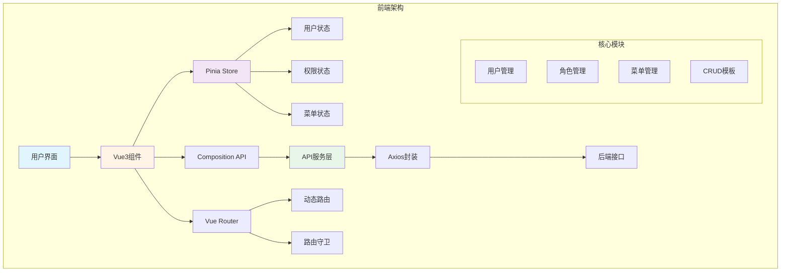

# 🚀 JOSP-FirstProjectVue3 - 用户登录注册系统前端


> Vue3前端 - 用户登录注册演示系统

## 📖 项目简介

JOSP-FirstProjectVue3 是一个基于Vue3的用户登录注册演示系统前端,提供完整的用户认证功能,包含登录、注册、表单验证等核心功能,是学习Vue3开发的理想入门项目。

**后端项目**: [JOSP-FirstProjectJava](../JOSP-FirstProjectJava)

## ✨ 核心特性

- 🎯 **用户登录** - 用户名密码登录验证
- 📝 **用户注册** - 新用户注册功能,密码二次确认
- 🔐 **Session管理** - 基于sessionStorage的token管理
- 🎨 **Element Plus** - 现代化UI组件库
- 💾 **Vuex状态管理** - 集中式状态管理
- 🚀 **Vue Router** - 单页应用路由管理

## 🏗️ 系统架构



## 🛠️ 技术栈

| 技术 | 版本 | 说明 |
|------|------|------|
| Vue | 3.2.13 | 渐进式JavaScript框架 |
| Vue CLI | 5.0.0 | Vue项目脚手架 |
| Element Plus | 2.3.0 | Vue3 UI组件库 |
| Vuex | 4.0.0 | Vue3状态管理 |
| Vue Router | 4.0.3 | Vue3官方路由 |
| Axios | 1.7.4 | HTTP客户端 |
| Core-js | 3.8.3 | JavaScript polyfill |

## 💡 核心功能模块

### 1. 用户登录模块

```vue
<!-- src/views/demoLogin.vue -->
<el-form :model="loginForm">
  <el-form-item label="用户名：">
    <el-input v-model="loginForm.username" />
  </el-form-item>
  <el-form-item label="密码：">
    <el-input v-model="loginForm.password" show-password />
  </el-form-item>
  <el-button @click="userLogin">登录</el-button>
</el-form>
```

**功能特性:**
- 用户名密码登录
- 密码加密传输
- SessionStorage token存储
- 登录成功后跳转首页
- 错误提示信息展示

### 2. 用户注册模块

```vue
<!-- src/views/demoRegister.vue -->
<el-form :model="loginForm">
  <el-form-item label="用户名：">
    <el-input v-model="loginForm.username" />
  </el-form-item>
  <el-form-item label="密码：">
    <el-input v-model="loginForm.password" show-password />
  </el-form-item>
  <el-form-item label="再次输入密码：">
    <el-input v-model="loginForm.confirmPassword" show-password />
  </el-form-item>
  <el-button @click="userLogin">注册</el-button>
</el-form>
```

**功能特性:**
- 新用户注册
- 二次密码确认验证
- 注册成功自动跳转登录页
- 复用后端登录接口实现注册

### 3. Axios请求封装

```javascript
// src/utils/axiosRequest.js
import axios from 'axios'

const axiosRequest = axios.create({
  baseURL: 'http://localhost:8088',
  timeout: 10000
})

// 响应拦截器
axiosRequest.interceptors.response.use(
  response => {
    return response.data
  }
)

export default axiosRequest
```

## 📁 项目结构

```
JOSP-FirstProjectVue3/
├── src/
│   ├── views/            # 页面组件
│   │   ├── demoLogin.vue       # 登录页面
│   │   ├── demoRegister.vue    # 注册页面
│   │   └── HomeView.vue        # 首页
│   ├── router/           # 路由配置
│   ├── store/            # Vuex状态管理
│   ├── utils/            # 工具函数
│   │   └── axiosRequest.js     # Axios封装
│   ├── components/       # 公共组件
│   ├── layout/           # 布局组件
│   ├── assets/           # 静态资源
│   ├── App.vue          # 根组件
│   └── main.js          # 入口文件
├── package.json         # 项目依赖
└── vue.config.js        # Vue CLI配置
```

## 🚀 快速开始

### 环境要求

- Node.js >= 16.0.0
- npm >= 8.0.0

### 安装运行

```bash
# 克隆项目
git clone https://github.com/your-username/JOSP-FirstProjectVue3.git

# 安装依赖
npm install

# 启动开发服务器
npm run dev

# 构建生产版本
npm run build

# 代码检查
npm run lint
```

## 📁 项目结构

```
JOSP-FirstProjectVue3/
├── src/
│   ├── api/            # API接口
│   ├── assets/         # 静态资源
│   ├── components/     # 公共组件
│   ├── composables/    # 组合式函数
│   ├── directives/     # 自定义指令
│   ├── hooks/          # 自定义钩子
│   ├── layouts/        # 布局组件
│   ├── router/         # 路由配置
│   ├── stores/         # Pinia状态
│   ├── styles/         # 样式文件
│   ├── types/          # TypeScript类型
│   ├── utils/          # 工具函数
│   └── views/          # 页面组件
├── vite.config.ts      # Vite配置
├── tsconfig.json       # TS配置
└── package.json        # 项目依赖
```

## 💡 核心功能

### 1. 通用CRUD组件

```vue
<template>
  <div class="crud-page">
    <!-- 搜索表单 -->
    <el-card class="search-card">
      <el-form :model="searchForm" inline>
        <el-form-item label="关键词">
          <el-input v-model="searchForm.keyword" placeholder="请输入关键词" />
        </el-form-item>
        <el-form-item>
          <el-button type="primary" @click="handleSearch">搜索</el-button>
          <el-button @click="handleReset">重置</el-button>
        </el-form-item>
      </el-form>
    </el-card>

    <!-- 操作按钮 -->
    <div class="toolbar">
      <el-button type="primary" @click="handleAdd">
        <el-icon><Plus /></el-icon> 新增
      </el-button>
      <el-button type="danger" @click="handleBatchDelete" :disabled="!selectedRows.length">
        <el-icon><Delete /></el-icon> 批量删除
      </el-button>
    </div>

    <!-- 数据表格 -->
    <el-table
      :data="tableData"
      @selection-change="handleSelectionChange"
      v-loading="loading"
      border
    >
      <el-table-column type="selection" width="55" />
      <el-table-column prop="id" label="ID" width="80" />
      <el-table-column prop="name" label="名称" />
      <el-table-column prop="createTime" label="创建时间" width="180" />
      <el-table-column label="操作" width="200">
        <template #default="{ row }">
          <el-button size="small" @click="handleEdit(row)">编辑</el-button>
          <el-button size="small" type="danger" @click="handleDelete(row.id)">删除</el-button>
        </template>
      </el-table-column>
    </el-table>

    <!-- 分页 -->
    <el-pagination
      v-model:current-page="pagination.page"
      v-model:page-size="pagination.size"
      :total="pagination.total"
      @current-change="fetchData"
      layout="total, sizes, prev, pager, next"
    />
  </div>
</template>

<script setup lang="ts">
import { ref, reactive, onMounted } from 'vue'
import { getList, deleteItem } from '@/api/crud'
import { ElMessage, ElMessageBox } from 'element-plus'

interface DataItem {
  id: number
  name: string
  createTime: string
}

const loading = ref(false)
const tableData = ref<DataItem[]>([])
const selectedRows = ref<DataItem[]>([])

const searchForm = reactive({
  keyword: ''
})

const pagination = reactive({
  page: 1,
  size: 10,
  total: 0
})

const fetchData = async () => {
  loading.value = true
  try {
    const res = await getList({
      ...searchForm,
      page: pagination.page,
      size: pagination.size
    })
    tableData.value = res.data.list
    pagination.total = res.data.total
  } finally {
    loading.value = false
  }
}

const handleSearch = () => {
  pagination.page = 1
  fetchData()
}

const handleReset = () => {
  searchForm.keyword = ''
  handleSearch()
}

const handleAdd = () => {
  // 打开新增对话框
}

const handleEdit = (row: DataItem) => {
  // 打开编辑对话框
}

const handleDelete = async (id: number) => {
  await ElMessageBox.confirm('确认删除该项吗?', '提示')
  await deleteItem(id)
  ElMessage.success('删除成功')
  fetchData()
}

const handleBatchDelete = async () => {
  const ids = selectedRows.value.map(row => row.id)
  await ElMessageBox.confirm(`确认删除选中的${ids.length}项吗?`, '提示')
  // 批量删除逻辑
}

const handleSelectionChange = (rows: DataItem[]) => {
  selectedRows.value = rows
}

onMounted(() => {
  fetchData()
})
</script>
```

### 2. 权限控制

```typescript
// stores/user.ts
import { defineStore } from 'pinia'
import { login, getUserInfo } from '@/api/user'

export const useUserStore = defineStore('user', {
  state: () => ({
    token: localStorage.getItem('token') || '',
    userInfo: null as UserInfo | null,
    permissions: [] as string[]
  }),
  
  getters: {
    isLoggedIn: (state) => !!state.token,
    hasPermission: (state) => (permission: string) => {
      return state.permissions.includes(permission)
    }
  },
  
  actions: {
    async login(credentials: LoginParams) {
      const res = await login(credentials)
      this.token = res.data.token
      localStorage.setItem('token', res.data.token)
      await this.getUserInfo()
    },
    
    async getUserInfo() {
      const res = await getUserInfo()
      this.userInfo = res.data.user
      this.permissions = res.data.permissions
    },
    
    logout() {
      this.token = ''
      this.userInfo = null
      this.permissions = []
      localStorage.removeItem('token')
    }
  }
})
```

### 3. 动态路由

```typescript
// router/index.ts
import { createRouter, createWebHistory } from 'vue-router'
import { useUserStore } from '@/stores/user'

const routes = [
  {
    path: '/login',
    name: 'Login',
    component: () => import('@/views/Login.vue')
  },
  {
    path: '/',
    name: 'Layout',
    component: () => import('@/layouts/MainLayout.vue'),
    redirect: '/home',
    children: [
      {
        path: 'home',
        name: 'Home',
        component: () => import('@/views/Home.vue')
      }
    ]
  }
]

const router = createRouter({
  history: createWebHistory(),
  routes
})

// 动态添加路由
export function addDynamicRoutes(menus: Menu[]) {
  const userStore = useUserStore()
  
  menus.forEach(menu => {
    if (menu.component) {
      router.addRoute('Layout', {
        path: menu.path,
        name: menu.name,
        component: () => import(`@/views/${menu.component}.vue`),
        meta: { title: menu.title, requiresAuth: true }
      })
    }
  })
}

// 路由守卫
router.beforeEach(async (to, from, next) => {
  const userStore = useUserStore()
  
  if (to.meta.requiresAuth && !userStore.isLoggedIn) {
    next('/login')
  } else if (userStore.isLoggedIn && !userStore.userInfo) {
    await userStore.getUserInfo()
    next()
  } else {
    next()
  }
})

export default router
```

### 4. TypeScript类型定义

```typescript
// types/index.ts
export interface UserInfo {
  id: number
  username: string
  nickname: string
  avatar: string
  email: string
  phone: string
  roles: string[]
}

export interface LoginParams {
  username: string
  password: string
}

export interface ApiResponse<T = any> {
  code: number
  message: string
  data: T
}

export interface PaginationParams {
  page: number
  size: number
}

export interface PaginationResponse<T> {
  list: T[]
  total: number
  page: number
  size: number
}
```

## 🎨 界面功能

- **登录页面** - 用户认证和记住密码
- **首页** - 数据概览和快捷入口
- **用户管理** - 用户增删改查
- **角色管理** - 角色权限分配
- **菜单管理** - 动态菜单配置
- **代码生成** - 自动生成CRUD代码

## 🔧 开发规范

### 组件命名

```
组件文件: PascalCase (UserList.vue)
组合式函数: camelCase (useUser.ts)
工具函数: camelCase (formatDate.ts)
```

### Git提交规范

```
feat: 新功能
fix: 修复bug
docs: 文档更新
style: 代码格式
refactor: 重构
test: 测试相关
chore: 构建/工具
```

## 📦 构建优化

```typescript
// vite.config.ts
import { defineConfig } from 'vite'
import vue from '@vitejs/plugin-vue'
import { resolve } from 'path'

export default defineConfig({
  plugins: [vue()],
  resolve: {
    alias: {
      '@': resolve(__dirname, 'src')
    }
  },
  build: {
    rollupOptions: {
      output: {
        manualChunks: {
          'element-plus': ['element-plus'],
          'vue-vendor': ['vue', 'vue-router', 'pinia']
        }
      }
    }
  }
})
```

## 🔗 相关项目

- 后端项目: [JOSP-FirstProjectJava](../JOSP-FirstProjectJava)
- 文档: [开发文档](https://docs.example.com)

## 📝 更新日志

### v1.0.0 (2024-01-01)
- ✨ 初始版本发布
- 🎨 完成基础CRUD功能
- 🔐 实现RBAC权限控制
- 📱 响应式布局适配

## 👥 作者

- **开发者**: JOSP Team

## 📄 许可证

[GNU Affero General Public License v3.0](LICENSE)

---

⭐️ 如果这个项目对你有帮助,请给一个星标支持!
