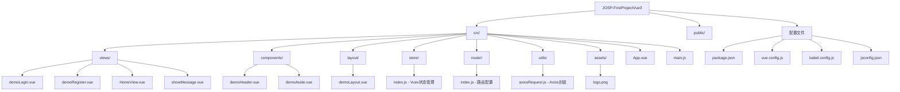
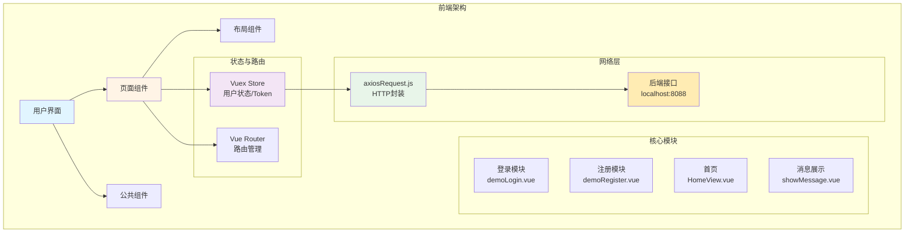

# JOSP-FirstProjectVue3 规格说明书

> 用户登录注册系统前端 - Vue3 演示项目

## 📖 项目简介

JOSP-FirstProjectVue3 是一个基于 Vue3 + vue-cli (webpack) 的用户登录注册演示系统前端。提供完整的用户认证功能，包括登录、注册、表单验证等核心功能。

**配套后端**: [JOSP-FirstProjectJava](../JOSP-FirstProjectJava)

## 🛠️ 技术栈版本

| 技术 | 版本 | 说明 |
|------|------|------|
| Vue | 3.2.13 | 渐进式 JavaScript 框架 |
| Vue CLI | 5.0.0 | Vue 项目脚手架 (webpack) |
| Element Plus | 2.11.0 | Vue3 UI 组件库 |
| Vuex | 4.0.0 | Vue3 状态管理 |
| Vue Router | 4.0.3 | Vue3 官方路由 |
| Axios | 1.13.5 | HTTP 客户端 |
| Core-js | 3.8.3 | JavaScript polyfill |

## 📁 目录结构



## 🏗️ 架构设计



## ✨ 核心功能

### 1. 用户登录 (`demoLogin.vue`)
- 用户名/密码表单验证
- SessionStorage Token 管理
- 登录成功跳转首页
- 错误提示信息展示

### 2. 用户注册 (`demoRegister.vue`)
- 新用户注册表单
- 密码二次确认验证
- 注册成功跳转登录页

### 3. 首页 (`HomeView.vue`)
- 登录用户欢迎信息
- 系统功能入口展示

### 4. Axios 封装 (`axiosRequest.js`)
- 统一请求拦截器
- 统一响应拦截器
- baseURL: `http://localhost:8088`
- 超时时间: 10000ms

### 5. Vuex 状态管理 (`store/index.js`)
- 用户登录状态
- Token 管理

### 6. 路由管理 (`router/index.js`)
- 路由守卫
- 登录状态校验

## 🚀 快速开始

```bash
# 安装依赖
npm install

# 启动开发服务器
npm run serve

# 构建生产版本
npm run build

# 代码检查
npm run lint
```

## ⚙️ 环境要求

- Node.js >= 16.0.0
- npm >= 8.0.0

## 📦 项目依赖

**dependencies:**
- vue: ^3.2.13
- vue-router: ^4.0.3
- vuex: ^4.0.0
- element-plus: ^2.11.0
- axios: ^1.13.5
- core-js: ^3.8.3

**devDependencies:**
- @vue/cli-service: ~5.0.0
- @vue/cli-plugin-babel: ~5.0.0
- @vue/cli-plugin-router: ~5.0.0
- @vue/cli-plugin-vuex: ~5.0.0
- @vue/cli-plugin-eslint: ~5.0.0
- eslint: ^8.57.1
- prettier: ^2.4.1
- lint-staged: ^11.1.2